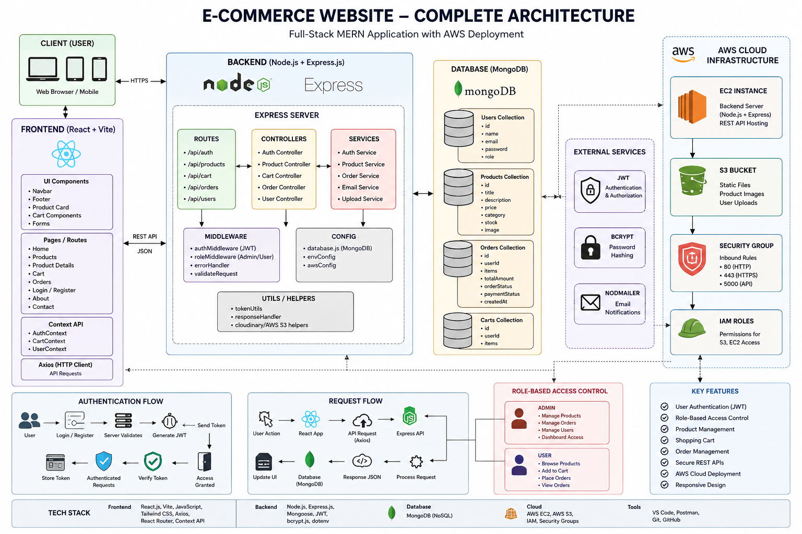

# E-commerce Website

A full-stack E-commerce platform built using the MERN stack with secure authentication, RESTful APIs, role-based access control, shopping cart functionality, order management, and cloud deployment support.

Repository Link:  
:contentReference[oaicite:0]{index=0}

---

# Introduction

The E-commerce Website is a scalable and secure full-stack web application designed to provide a seamless online shopping experience. The platform allows users to browse products, manage carts, place orders, and securely authenticate into the system.

The application follows a modular architecture with separate frontend and backend services to ensure maintainability, scalability, and efficient deployment.

The project demonstrates:
- Full-stack MERN development
- REST API design
- Authentication and authorization
- Cloud deployment concepts
- State management
- Component-based frontend architecture
- Backend modularization

---

# System Architecture




# Features

## User Features

- User Registration and Login
- Secure Authentication
- Product Browsing
- Product Detail View
- Shopping Cart
- Order Placement
- Responsive UI
- Category-based Product Listing

## Admin Features

- Role-Based Access Control
- Product Management
- Order Management
- User Management

## Technical Features

- RESTful API Integration
- JWT Authentication
- Modular Backend Architecture
- Context API State Management
- Cloud Deployment Support
- Scalable Project Structure

---

# Tech Stack

## Frontend
- React.js
- Vite
- JavaScript
- Tailwind CSS
- Axios
- React Router DOM
- Context API

## Backend
- Node.js
- Express.js
- MongoDB
- Mongoose
- JWT Authentication
- bcrypt.js

## Deployment & Cloud
- AWS EC2
- AWS S3
- GitHub

---

# System Architecture

```text
Client (React Frontend)
        |
        | HTTP Requests (REST APIs)
        v
Node.js + Express Backend
        |
        | Mongoose ODM
        v
MongoDB Database
```

---

# Project Structure

```text
E-commerce/
│
├── frontend/
│   ├── public/
│   ├── src/
│   │   ├── assets/
│   │   ├── components/
│   │   ├── context/
│   │   ├── pages/
│   │   ├── main.jsx
│   │   └── index.js
│   │
│   ├── package.json
│   └── vite.config.js
│
├── backend/
│   ├── config/
│   ├── controllers/
│   ├── middleware/
│   ├── models/
│   ├── routes/
│   ├── services/
│   ├── server.js
│   └── package.json
│
└── README.md
```

---

# Frontend Architecture

The frontend is developed using React.js with a component-based architecture.

## Core Directories

### components/
Contains reusable UI components:
- Navbar
- Footer
- Product Cards
- Cart Components
- Hero Sections

### pages/
Contains route-level pages:
- Home
- Products
- Product
- Cart
- Orders
- Login
- Contact
- About

### context/
Implements global state management using Context API.

### assets/
Stores images, icons, and static resources.

---

# Backend Architecture

The backend follows a layered architecture.

## config/
Database configuration and environment setup.

## controllers/
Contains business logic for:
- Authentication
- Product operations
- Cart operations
- Order management

## middleware/
Custom middleware for:
- Authentication
- Authorization
- Error handling

## models/
MongoDB schemas and database models.

## routes/
Defines REST API routes.

## services/
Contains reusable service logic and utilities.

---

# Authentication Flow

```text
User Login/Register
        |
        v
Backend Authentication API
        |
        v
JWT Token Generation
        |
        v
Token Stored on Client
        |
        v
Authenticated API Requests
```

---

# API Endpoints

## Authentication

| Method | Endpoint | Description |
|--------|----------|-------------|
| POST | /api/auth/register | Register User |
| POST | /api/auth/login | Login User |

## Products

| Method | Endpoint | Description |
|--------|----------|-------------|
| GET | /api/products | Fetch Products |
| GET | /api/products/:id | Fetch Product Details |

## Orders

| Method | Endpoint | Description |
|--------|----------|-------------|
| POST | /api/orders | Create Order |
| GET | /api/orders | Get User Orders |

---

# Database Design

## User Schema

```text
User
- name
- email
- password
- role
```

## Product Schema

```text
Product
- title
- description
- category
- price
- image
- stock
```

## Order Schema

```text
Order
- userId
- products
- totalAmount
- paymentStatus
- orderStatus
```

---

# Installation and Setup

## Clone Repository

```bash
git clone https://github.com/lovelymahor/E-commerce.git
```

---

# Frontend Setup

```bash
cd frontend
npm install
npm run dev
```

Frontend runs on:
```text
http://localhost:5173
```

---

# Backend Setup

```bash
cd backend
npm install
npm start
```

Backend runs on:
```text
http://localhost:5000
```

---

# Environment Variables

Create a `.env` file inside backend directory.

```env
PORT=5000
MONGO_URI=your_mongodb_connection
JWT_SECRET=your_secret_key
AWS_ACCESS_KEY=your_access_key
AWS_SECRET_KEY=your_secret_key
AWS_BUCKET_NAME=your_bucket_name
```

---

# Running the Project

## Start Frontend

```bash
cd frontend
npm run dev
```

## Start Backend

```bash
cd backend
npm start
```

---

# AWS Deployment

## AWS Services Used

### EC2
Used for hosting backend services.

### S3
Used for storing static assets and media files.

## Deployment Workflow

```text
Frontend → AWS Hosting
Backend → EC2 Instance
Assets → AWS S3
Database → MongoDB
```

---

# Future Enhancements

- Payment Gateway Integration
- Wishlist Functionality
- Product Reviews and Ratings
- Admin Dashboard Analytics
- Inventory Management
- Email Notifications
- Order Tracking
- Docker Support
- CI/CD Pipeline

---

# Contributing

Contributions are welcome.

Steps to contribute:

```bash
1. Fork the repository
2. Create a feature branch
3. Commit changes
4. Push the branch
5. Open a Pull Request
```

---

# License

This project is licensed under the MIT License.

---
